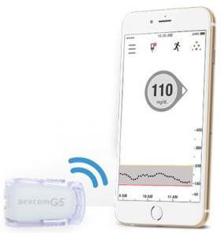
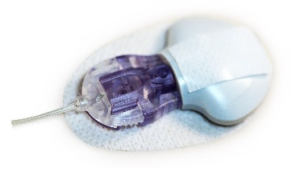

## Compatible CGM

!!! info "Time Estimate"

    - 10 minutes to read this page

!!! abstract "Summary"

    iAPS is compatible with:

    - Dexcom G4 Share, G5, G6, G7 or ONE CGM systems
        * Dexcom ONE is available in some countries
    - Medtronic enlite sensors connected to a iAPS compatible Medtronic pumps
    - Libre 1 or European Union Libre 2

## Continuous Glucose Monitor (CGM)

iAPS uses your CGM glucose readings, carbohydrate input and therapy settings, to model your current glucose trend, predict future glucose and automatically adjust insulin dosing. A compatible CGM is essential to operation of the iAPS app.

## Dexcom G5, G6, G7 and ONE CGM {width="150"}

The Dexcom sensors transmit data directly to the Dexcom app on your iPhone via Bluetooth.

The Dexcom ONE, available in some countries, acts just like the G6 as far as iAPS is concerned. The Dexcom ONE app does not provide some features, such as Dexcom Share, that come with the G6. When you set up iAPS, select Dexcom G6 as your CGM to use Dexcom ONE CGM with the Dexcom ONE app installed on your phone.

If the Dexcom app is on the same device as iAPS, iAPS can function without an internet connection. See Offline Use below.

## Medtronic CGM {width="150"}

The Minimed Enlite CGM, available with the Medtronic 522/722, 523/723, and 554/754, wirelessly sends glucose readings to the pump. iAPS can read the Medtronic CGM data directly from the pump using a RileyLink compatible device.

## Offline Use

"Offline Use" means using iAPS when there is no cell data or internet available. iAPS does not require any special setup to operate offline.

For offline iAPS use, the iPhone's Bluetooth still needs to be active; and for Dexcom users, the G5, G6 or G7 app also needs to be running on your iAPS phone. If you put your iPhone into Airplane mode, remember to turn Bluetooth back on to keep your iAPS running. If your offline use is failing, chances are you have forgotten to update your transmitter ID in iAPS settings when you changed transmitters.