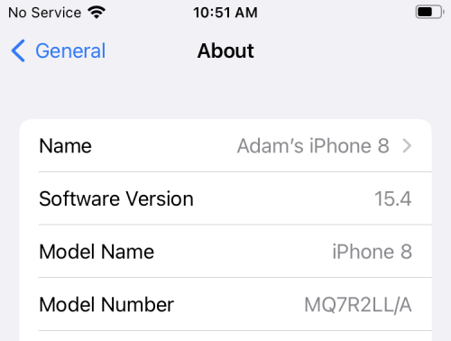

## Compatible iPhone or iPod touch

!!! info "Time Estimate"
    - 5 minutes, to check your device and iOS
    - 20 minutes, if need to update your compatible device to a new iOS
    - 10 minutes, if you need to order a [compatible device](iphone.md#compatible-devices) from Apple website
    - 0 minutes, if you own an Android device and won't buy Apple products; check out [AndroidAPS Documention](https://androidaps.readthedocs.io/en/latest/)

!!! abstract "Summary"
    - Check your iPhone/iPod touch against the device compatibility list
        * For all devices, the newest iOS is strongly recommended
    - Make sure the phone has good battery life
    - Turn off automatic updates

!!! question "FAQs"
    - **"Can I use an Android?"** No. Check out [AndroidAPS Documention](https://androidaps.readthedocs.io/en/latest/).
    - **"Does my iPhone need a cell plan?"** No. FreeAPS X works using communication on your phone with your CGM and your pump; no internet connection required. However, if access to Dexcom Follow or Nightscout monitoring of FreeAPS X is a priority, then a cell plan may be desired.

## Which Devices Are Compatible?

FreeAPS X requires a relatively recent iPhone. The faster the phone, the better for the algorithm. You need a minimum version of the mobile operating software, called the phone's "iOS", to be installed on your iPhone or iPod touch. FreeAPS X is compatible with iPhones running on iOS 15.1 or newer.

### Compatible Devices

These devices are compatible with iOS 15.1 and newer iOS.

- iPhone 14, all variants
- iPhone 13, all variants
- iPhone 12, all variants
- iPhone 11, all variants
- iPhone X, all variants
- iPhone 8, all variants
- iPhone SE (3rd generation or later model; 2022 first release)
- iPhone SE (2nd generation; 2020 first release)

These devices are compatible with FreeAPS X, which requires iOS 15.1, but cannot be upgraded to iOS 16.

- iPhone 7, all variants
- iPhone 6s, all variants - but note the "s"
- iPhone SE (1st generation; 2016 first release)

## Find Your Device's iOS

Your phone's iOS version can be found under the phone Settings -> General -> About display as shown below. The iOS number is found on the `Software Version` line. When you start on looping, you should delay iOS updates until others have confirmed the software functions as normal on the newest update.

{width="300"}

### Developer Mode - Mac Build

With iOS 16 and watchOS 9, Apple added a feature. If you want to know more, click on this [Apple Link about Developer Mode](https://developer.apple.com/documentation/xcode/enabling-developer-mode-on-a-device).

When you build FreeAPS X on your phone from Xcode directly and then transition to or start with iOS 16, you need to have Developer Mode enabled. This is also a requirement to use the FreeAPS X app on a watch paired to your phone running watchOS 9. 

!!! info "Developer Mode with iOS 16, watchOS 9"
    If you already have FreeAPS X, built with Xcode on a Mac, on your phone/watch when you update to iOS 16/watchOS 9, you will be told that FreeAPS X requires Developer Mode to run.
    
    You will not be able to run FreeAPS X on your phone (or watch) until you have enabled Developer Mode on the device(s).

    {width="300"}
    {align="center"}

## Battery Health

Make sure the battery on your phone is solid. Your phone will become a critical health device - you want it to keep working.

* Make sure a charger and cord are in your diabetes supplies
* Consider buying a battery pack, keep it charged and add it to your travel bag

!!! tip "Low Power Mode"
    With newer iOS (15 and 16), some people have reported FreeAPS X continues working in the background (phone locked) even in [Low Power Mode](https://support.apple.com/en-us/HT205234). Others, have reported they still get red loops. You can experiment to determine if your phone/iOS/app is able to maintain green loops in low power mode.  Otherwise, best practice is to avoid Low Power Mode.

## Turn Off Automatic Updates

Apple provides updates regularly to the iOS.  Often, these updates include critical security patches in addition to improved new features.

### Why Turn off Automatic Updates?

* Once you accept an iOS phone update, you cannot go backwards
    * Some iOS updates require updates to Xcode and macOS before people can build FreeAPS X on that device again
    * It is rare, but iOS updates have caused FreeAPS X to stop working until other updates were made and FreeAPS X was rebuilt on that phone
* Turn off automatic updates so you can choose when to update your phone and avoid being caught without a working FreeAPS X app
* Google the instructions for your device:
    1. Configure your phone to automatically download the updates
    1. Choose to perform the installation of the updates manually

