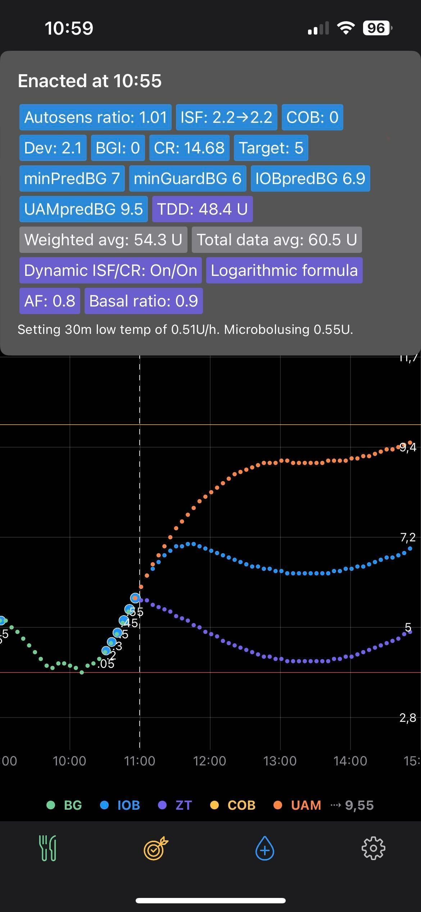
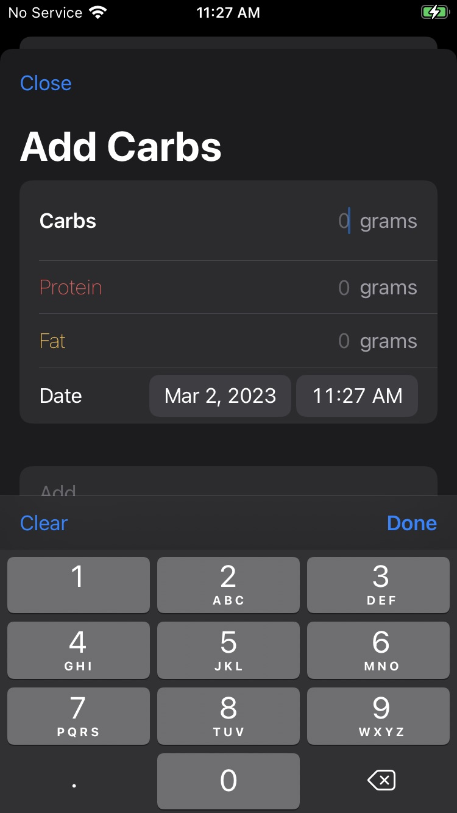
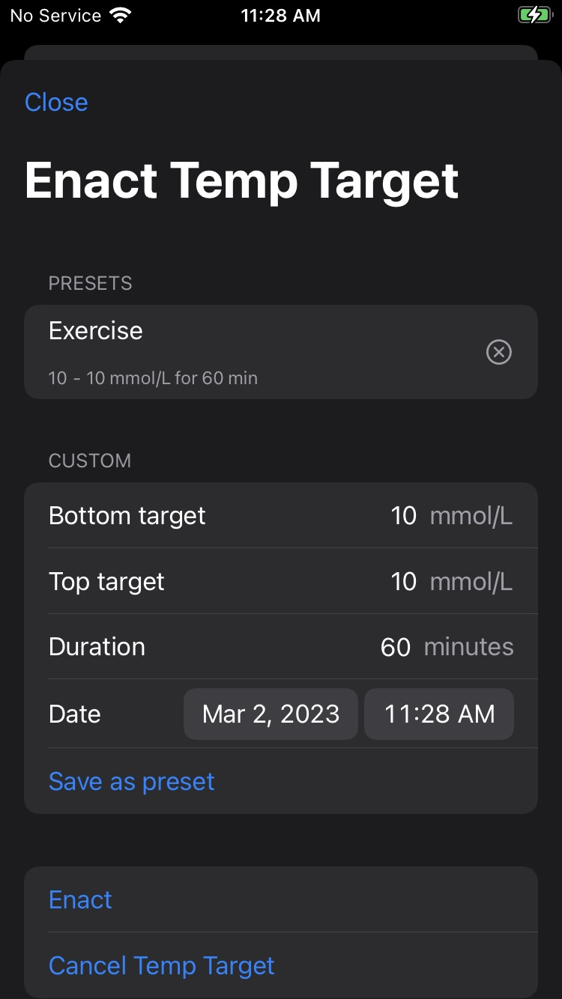

# User Interface

## Main Screen
{width="250"}
{width="250"}

The main screen of iAPS can be divided into three sections: 

- Status (top)
- Graphs and Statistics (middle)
- Actions (bottom)

### Status
The Status section shows your current insulin on board (IOB), carbs on board (COB), blood glucose, pump status, and looping status. A yellow loop indicates a loop cycle has not occured in the last 30 minutes, whereas a red loop indicates a cycle has not occured for longer. 

Tapping the top of the screen will give you information on changes implemented by the most recent loop cycle.

### Graphs and Statistics
The middle of the screen graphs your current blood sugar data and inputted carbs overlayed with iAPS's insulin delivery and blood sugar predictions.

The zero temp (ZT) line predicts where your blood sugar would be if insulin delivery and carb absorption were ceased. The IOB line predicts where blood sugar would be if insulin deliver was ceased and carb absorption were minimal. The unannounced meal (UAM) line predicts how long blood glucose will continue to rise, to dose insulin accordingly. For more information on prediction lines, see the [OpenAPS documentation.](https://openaps.readthedocs.io/en/latest/docs/While%20You%20Wait%20For%20Gear/Understand-determine-basal.html)

If enabled, statistics are displayed underneath these graphs detailing your time in range, coefficent of variance (CV) and average glucose. Tapping in this area allows you to change the time interval used to calculate these statistics.

### Actions
At the bottom of the screen, you have four action icons:

- Meal bolus
- Temp Targets
- Correction Bolus
- Settings

The left icon is the meal bolus option which allows you to enter Carbs and bolus accordingly. If you have "Fat And Protein Conversion" enabled, you will also be provided the option to enter fat and protein content in grams.

The target icon allows you to set temporary targets. Most common targets are a high target for exercise, and a low target in preparation for meals. 

The insulin drop icon allows you to give manual correction boluses. Manually correcting is not recommended if you are using iAPS's SMB and UAM feature.

The rightmost icon allows you to access your iAPS settings. The settings screen allows you to adjust your configuration. Please see [Configure](../settings/devices/pump.md) for more information on each configuration option.

{width="250"}
{width="250"}

